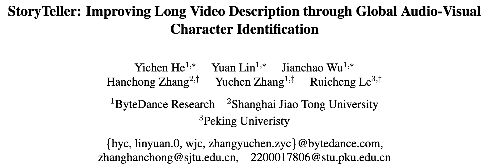
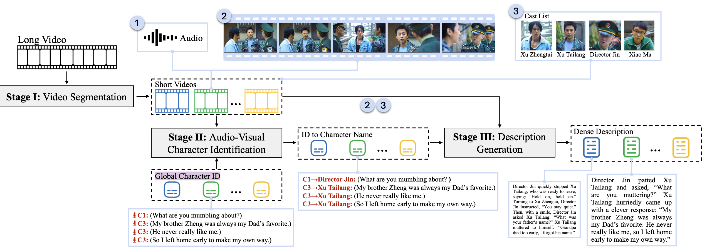
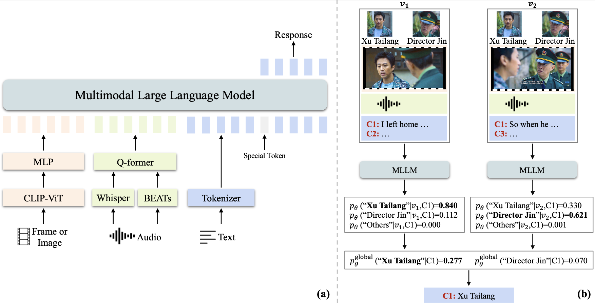
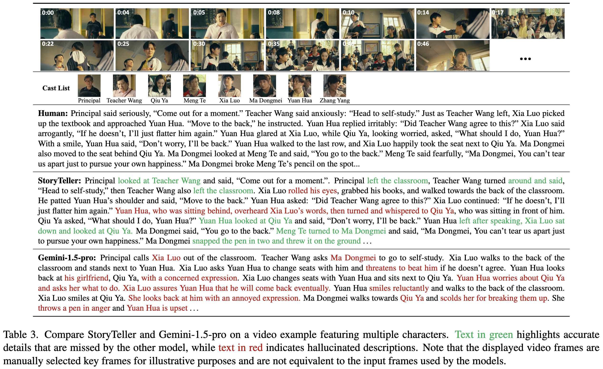
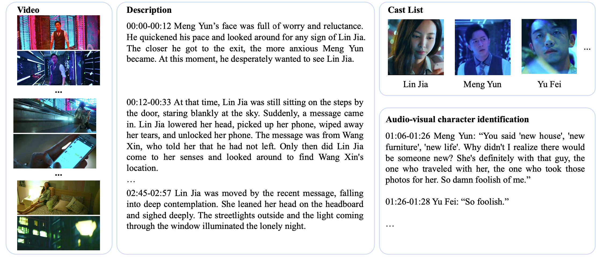
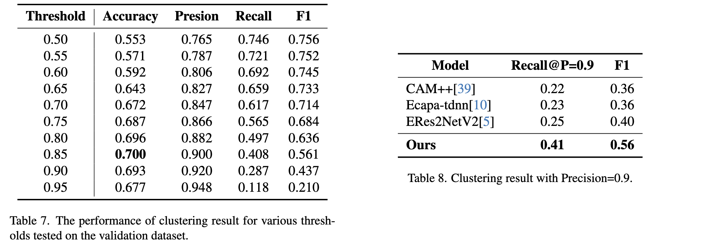
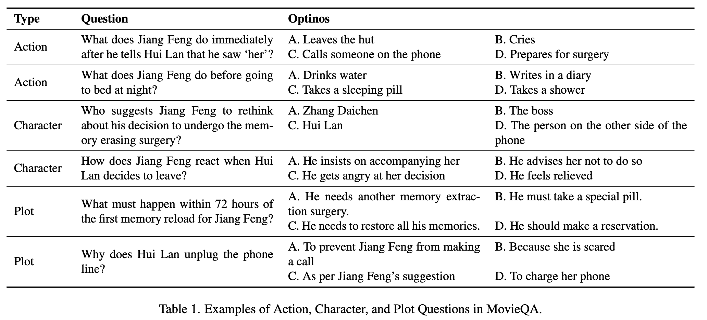
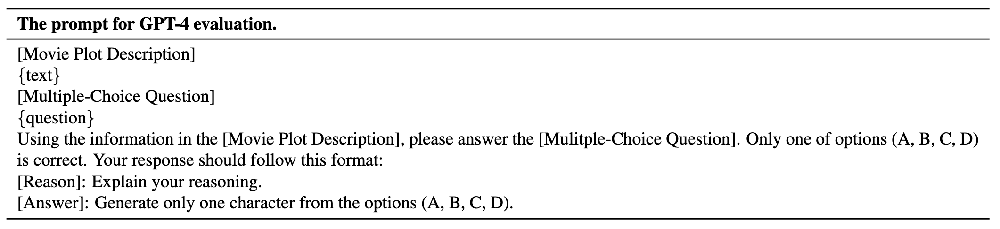
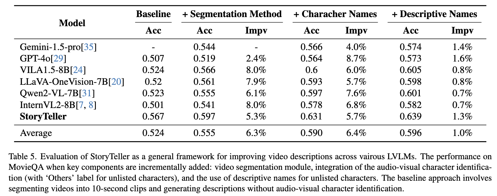
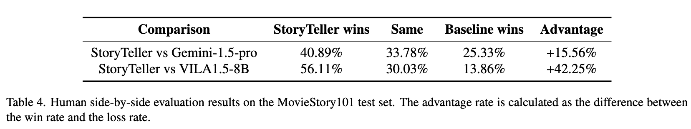

## Introduction

Existing large vision-language models (LVLMs) are largely limited to processing short, seconds-long videos and struggle with generating coherent descriptions for extended video spanning minutes or more. Long video description introduces new challenges, such as plot-level consistency across descriptions. To address these, we figure out audio-visual character identification, matching character names to each dialogue, as a key factor. We propose StoryTeller, a system for generating dense descriptions of long videos, incorporating both low-level visual concepts and high-level plot information. StoryTeller uses a multimodal large language model that integrates visual, audio, and text modalities to perform audio-visual character identification on minute-long video clips. The results are then fed into a LVLM to enhance consistency of video description.

### Framework

The above figure shows pipeline of StoryTeller, consisting of three main modules: Stage I - Video Segmentation, where long videos are divided into seconds-long clips that are relatively independent and internally complete; Stage II - Audio-Visual Character Identification, where characters are identified for each dialogue line using both audio and visual cues; and Stage III - Description Generation, where detailed descriptions are generated for each short clip, ultimately producing a coherent and consistent narrative for the entire long video.

### Audio-Visual Character Identification

The above figure shows audio-visual character identification module. (a) A multimodal large language model integrating visual, audio and text inputs is employed to identify characters in seconds-long videos. (b) Global Decoding: During inference, consistent mapping of global IDs across different short clips ensures the same global ID is assigned the same character name.



## Get Start

A step-by-step introduction to the process of the entire Long Video Description pipeline. We also provide intermediate results generated by each step, so you can start from any step.

### Annotated Data
1. Caption: `data/raw_data/caption.json`
2. Audio Diarization: `data/raw_data/diarization.json`
3. Partition of Dataset: `data/raw_data/split.json`
4. Main Actor in each Clip: `data/raw_data/ref_actor`
5. MovieQA: `data/raw_data/movie_qa.jsonl`

    
    The above figure shows an example of the data in MovieStory101. Each consists of a 3-minute video, a detailed description, a corresponding cast list, and subtitles with character names.

> The dataset split statistics in the paper are incorrect. Please refer to `data/raw_data/detailed_split.json` for accuracy. "The final MovieStory101 dataset includes 5,210 / 140 / 632 clips in the training / development / testing split." We will make corrections in the next version of the paper.

### Video Files
https://huggingface.co/datasets/hyc2026/MovieStory101

You can apply for permission on huggingface or contact `hyc@bytedance.com` to add permission directly (with your huggingface user name).

### 1. Generate the frames and audio files by processing the video.
```bash
python script/preprocess/preprocess.py
```
- Input video path: data/video
- Output frame path: data/frame
- Output audio path: data/audio

#### Complete Data
```
data
├── audio
├── audio_visual_diarization
├── frame
├── global_diarization
├── long_video_description
├── raw_data
├── scene_detect
└── video
```

### 2. Split the 3-min video clip into small segments through auto scene change detection and some rules.
First, split the video into small segments through auto scene change detection, the results are stored in `data/raw_data/scene_detect`.
```bash
pip install scenedetect
scenedetect -i movie.mp4 -o data/raw_data/scene_detect -q detect-adaptive -t 2.0 list-scenes
```
Then some post-processing steps will be used to process the generated storyboard data, to merge short segments and to ensure that a single dialogue is not cut into two segments as much as possible, the final split file is saved in `data/scene_detect/scene_split_new.json`.
```bash
python script/scene_split/scene_split.py
python script/scene_split/update_scene_split.py
```

### 3. Generate reference photos for each character in the 3-min clip.
For the MovieQA dataset, we provided a cast list for each clip in advance. For other movies, the cast list can be easily obtained from the IMDb cast list and a general facial recognition algorithm.

### 4. Do the global audio diarization in each 3-min clip.
Model: ERes2NetV2 \
Model Path: checkpoints/eres2netv2/embedding_model.ckpt

> Please note that our audio embedding model is finetuned on 167 chinese movies, if you want to achieve better results in movies in other languages, you can consider using the origin model.

We simply use the inference code in the repo: [3D-Speaker](https://github.com/modelscope/3D-Speaker), and get the audio embedding of each input audio. The predict embeddings are saved in `data/global_diarization/embeddings.jsonl`.

Evaluation the performance of the embeddings:
```bash
python script/global_diarization/eval_embedding.py --input_file data/global_diarization/embeddings.jsonl
```

Then, a clustering algorithm is used to assign the same Global ID to embeddings that are close in distance, the result is saved in `data/global_diarization/diarization_id.jsonl`. The same global ID means that the model predicts that these dialogs are spoken by the same person.
```bash
python script/global_diarization/update_diarization.py --input_file data/global_diarization/embeddings.jsonl --output_file data/global_diarization/diarization_id.jsonl
```



### 5. Audio Visual Character Identification

Model: Tarsier-7B with OpenAI Wisper-large-v2 audio encoder \
Model Path: checkpoints/Whisper-large-v2-Tarsier-7B-character-identification

In step 4, we have assigned a unique ID to each segment of the audio. Now, we will use MLLM to map each ID to a character in the actor list. If the character is not in the actor list, a description will be generated for it.

Generate input inference data and saved in `data/audio_visual_diarization/data.jsonl`
```bash
python script/audio_visual_diarization/gen_infer.py
```

Inferece the character name for each global ID.
```bash
python tasks/inference_quick_start.py \
    --model_name_or_path checkpoints/Whisper-large-v2-Tarsier-7B-character-identification \
    --input_path data/audio_visual_diarization/data.jsonl \
    --output_path data/audio_visual_diarization/0.jsonl
```

Find conflict inference and generate to be corrected inference data saved in `data/audio_visual_diarization/align_data/data.jsonl`
```bash
python script/audio_visual_diarization/alignment.py
```

Inferece the probability for each conflict ID-name pairs.
```bash
python tasks/inference_quick_start.py \
    --model_name_or_path checkpoints/Whisper-large-v2-Tarsier-7B-character-identification \
    --input_path data/audio_visual_diarization/align_data/data.jsonl \
    --output_path data/audio_visual_diarization/correct/0.jsonl
```

Generate the final corrected global audio diarization results, saved in `data/audio_visual_diarization/correct/test_diarization.json`

Character identification accuracy improvement before and after global audio diarization correction.


### 6. Long Description Generation

Model: Tarsier-7B \
Model Path: checkpoints/Tarsier-7B-description-generation

Generating the final video description using the recognition results from step 5.

Generate input inference data and saved in `data/long_video_description/data.jsonl`
```python
python script/long_video_description/gen_infer.py
```

Inferece the description for each short video clip.
```bash
python tasks/inference_quick_start.py \
    --model_name_or_path checkpoints/Tarsier-7B-description-generation \
    --input_path data/long_video_description/data.jsonl \
    --output_path data/long_video_description/0.jsonl
```

Generate the danse descriptions.
```bash
python dense_description.py
```

Evaluation the description by answering MovieQAs.


```bash
python script/long_video_description/eval_qa_accuracy.py \
    --pred_caption_path result/tarsier/dense_caption_name.json \
    --out_path result/tarsier/qa_name.jsonl
```


The output of each model can be found in `result`





## Checkpoints
Coming soon.

## Citation
Pleae cite us as:

```BibTeX
@misc{he2024storyteller,
      title={StoryTeller: Improving Long Video Description through Global Audio-Visual Character Identification}, 
      author={Yichen He and Yuan Lin and Jianchao Wu and Hanchong Zhang and Yuchen Zhang and Ruicheng Le},
      year={2024},
      eprint={2411.07076},
      archivePrefix={arXiv},
      primaryClass={cs.CV}
}
```